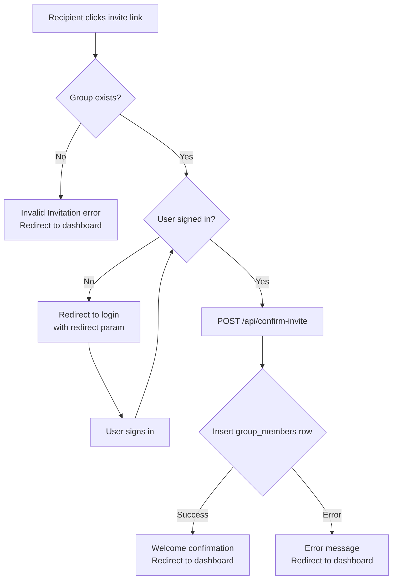

Any existing member of a group can invite others by sharing a unique invite link. When the recipient clicks the link, Snippet validates the group, authenticates the recipient, and adds them as a member automatically.

## How to invite someone

<Steps>
  <Step title="Open the Invite Members dialog">
    On the group detail page, click **Invite Members** in either the group header or the **Members** panel in the sidebar.
  </Step>
  <Step title="Copy the invite link">
    The dialog shows a pre-generated invite link in a read-only field. Click the copy button (clipboard icon) to copy the link to your clipboard. A "Copied!" confirmation appears briefly.

    You can also click the link field to select all text, then copy manually.
  </Step>
  <Step title="Share the link">
    Send the invite link to the person you want to add — via email, chat, or any other channel. Anyone who has the link can use it to join the group.
  </Step>
</Steps>

<Warning>
  The invite link grants access to anyone who has it. There is no per-recipient restriction. Keep the link private if you want to control who joins.
</Warning>

## Invite link format

Every invite link follows this pattern:

```
https://<your-domain>/invite_user?group_id=<group-uuid>
```

The `group_id` query parameter contains the UUID of the target group. The link is generated client-side using `window.location.origin` combined with the group ID.

## What happens when an invitee clicks the link

<Steps>
  <Step title="Group validation">
    The `/invite_user` page reads the `group_id` from the URL and queries the `groups` table to confirm the group exists. If the group ID is missing or does not match any record, the page shows an **Invalid Invitation** error and redirects to the dashboard after 3 seconds.
  </Step>
  <Step title="Authentication check">
    Snippet checks whether the recipient is signed in. If they are not, they are redirected to the login page with the invite URL preserved as a `redirect` parameter:

    ```
    /login?redirect=%2Finvite_user%3Fgroup_id%3D<group-uuid>
    ```

    After signing in, Snippet returns them to the invite URL automatically.
  </Step>
  <Step title="Joining the group">
    Once authenticated, the page calls `POST /api/confirm-invite` with the user's ID and the group ID. The API inserts a row into the `group_members` table:

    ```json
    {
      "member_id": "<user-uuid>",
      "group_id": "<group-uuid>"
    }
    ```

    The `joined_at` timestamp is set automatically to the current time.
  </Step>
  <Step title="Redirect to dashboard">
    On success, the page shows a **Welcome to the Group!** confirmation and redirects to the dashboard after 2 seconds. If the user is already a member, the API returns an error and the page redirects to the dashboard after 3 seconds.
  </Step>
</Steps>

## Invite flow diagram



## Member list

The **Members** panel on the group detail page shows everyone who has joined via invite or creation.

Each member entry includes:

| Field | Description |
|---|---|
| Username | Derived from the member's email address (everything before `@`) |
| Joined on | The `joined_at` date from the `group_members` table |

The member count appears in the group header stats bar alongside the track count.

<Tip>
  You can also open the **Invite Members** dialog directly from the Members panel by clicking the invite icon button in the panel header.
</Tip>

## Related pages

<CardGroup cols={2}>
  <Card title="Groups" icon="users" href="/features/groups">
    Learn how groups work and view group tracks.
  </Card>
  <Card title="Uploading tracks" icon="upload" href="/features/uploading-tracks">
    Share audio files once your members have joined.
  </Card>
</CardGroup>
