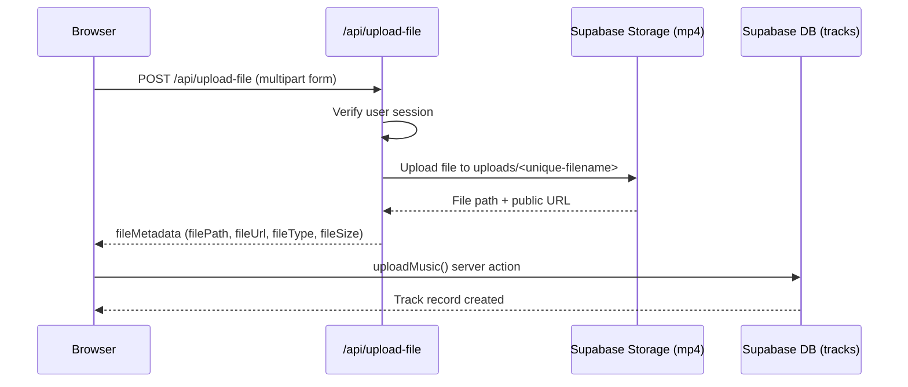

You can upload audio files to any group you belong to. Once uploaded, every member of that group can play, download, and browse the track from the group page and the library.

## How to upload a track

<Steps>
  <Step title="Open the Upload Track dialog">
    Navigate to the group you want to share the track in, then click **Upload Track** in the group header.
  </Step>
  <Step title="Select your file">
    In the dialog, click **Select File** or drag and drop a file onto the upload area. Only MP3 and MP4 files up to 50 MB are accepted. If you select an unsupported file type, the dialog rejects it before upload begins.
  </Step>
  <Step title="Enter the track title">
    Type the track title in the **Track Title** field. This field is required.
  </Step>
  <Step title="Enter the artist name">
    Type the artist name in the **Artist** field. This field is required.
  </Step>
  <Step title="Choose a group">
    Use the **Share with Group** dropdown to select which of your groups will receive the track. The dropdown lists all groups you are a member of.
  </Step>
  <Step title="Upload">
    Click **Upload Track**. A spinner indicates progress. The dialog closes automatically when the upload succeeds, and the track appears in the group's **Shared Tracks** list.
  </Step>
</Steps>

<Warning>
  All four fields — file, title, artist, and group — are required. The **Upload Track** button stays disabled until every field is filled.
</Warning>

## Supported file types and size limit

| Format | MIME type |
|---|---|
| MP3 | `audio/mpeg` |
| MP4 audio | `audio/mp4` |
| MP4 video | `video/mp4` |

The maximum file size is **50 MB**. Files are validated client-side before the upload request is sent.

## Track metadata

The following metadata is stored in the `tracks` table for each uploaded file:

| Field | Type | Description |
|---|---|---|
| `id` | `string` | Unique track identifier (UUID) |
| `title` | `string` | Track title entered at upload |
| `artist` | `string` | Artist name entered at upload |
| `group_id` | `string` | ID of the group the track belongs to |
| `uploaded_by` | `string` | UUID of the user who uploaded the track |
| `upload_date` | `string \| null` | ISO timestamp of when the upload occurred |
| `file_path` | `string` | Storage path within the `mp4` bucket (e.g. `uploads/<timestamp>-<random>.<ext>`) |
| `file_url` | `string` | Public URL for the file in Supabase Storage |
| `file_type` | `string` | MIME type of the uploaded file |
| `file_size` | `number` | File size in bytes |

## How the upload process works

The upload uses a two-step process to separate file storage from database record creation:

**Step 1 — File storage:** The browser sends the file as `multipart/form-data` to `POST /api/upload-file`. The API route verifies the authenticated session, generates a unique filename using a timestamp and random string (e.g. `uploads/1714000000000-abc123def.mp3`), and uploads the file to the `mp4` Supabase Storage bucket. It returns the file path, public URL, MIME type, and size.

**Step 2 — Database record:** The browser calls the `uploadMusic` server action with the file metadata plus the title, artist, and group ID. The action inserts a row into the `tracks` table and revalidates the library and group pages so the new track appears immediately.

<Note>
  Files are stored in the `mp4` Supabase Storage bucket regardless of whether the file is an MP3 or MP4. The actual MIME type is recorded in the `file_type` field on the track record.
</Note>

## Related pages

<CardGroup cols={2}>
  <Card title="Music library" icon="library" href="/features/music-library">
    Browse and play all tracks you have uploaded or that have been shared with you.
  </Card>
  <Card title="Groups" icon="users" href="/features/groups">
    Learn how groups work and how to manage group membership.
  </Card>
</CardGroup>
